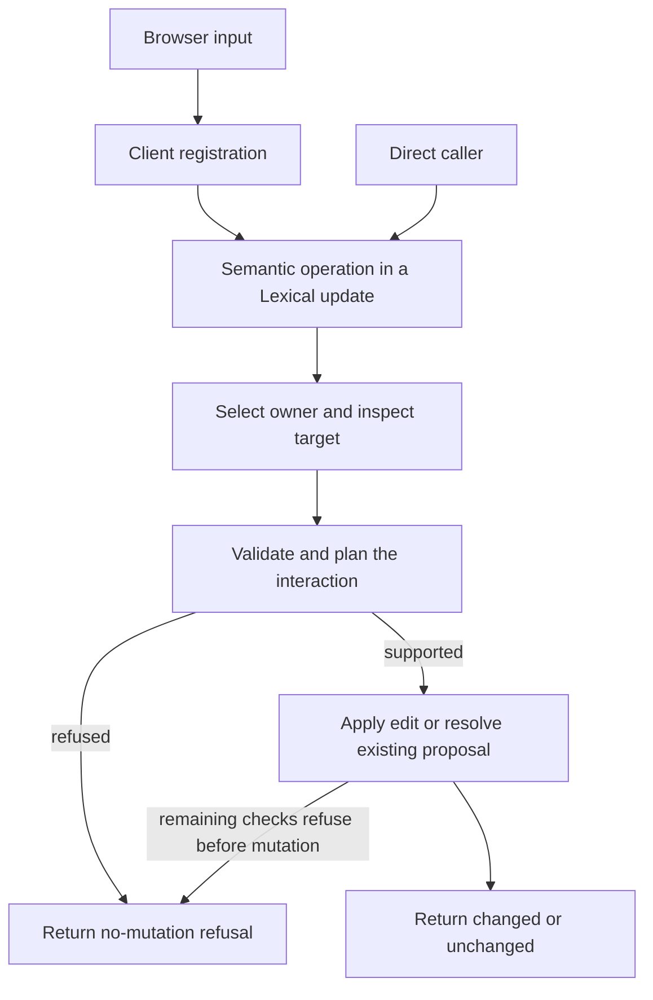

# How Lexical Review works

Lexical Review turns editing input into predictable review interactions. This
page explains how the package works and the principles guiding its direction,
for applications using it and contributors changing it. The ownership and
behavior guarantees below describe the current design so implementations can
be simplified without changing what callers observe. Modules describe
responsibilities, not a required file layout.

## Principles

These principles are the package's north star:

Preserve the author's intent with the fewest proposals that retain meaningful
independent review decisions. Keep common proposal resolution to one action.
Refuse without mutation rather than silently lose meaning, including when
exchanging documents. Make the next keystroke's target unambiguous.

Prefer the simplest implementation that preserves these behaviors. Add
abstractions for demonstrated needs.

## How we use Lexical

Lexical provides the editor tree, selection, read/update transactions, and
browser command handling. The following sections connect the domain terms in
[CONTEXT.md](CONTEXT.md) to these implementation facilities.

### Review state and authoring session

The live Lexical `EditorState` represents review state during an authoring
session. It is the authoritative working representation of accepted content
and pending revision proposals. The session reads this state and exports
snapshots.

### Representing proposals in the tree

The [proposal behavior contract](docs/proposal-behavior.md#one-proposal-one-review-decision)
defines proposal identity and what resolves together. In the editor tree, each
proposal is represented by one or more review nodes carrying its required
proposal ID. Nodes representing parts of the same proposal carry the same ID.
For example, a replacement's deletion and insertion nodes share an ID so
inspection and resolution can address both sides as one proposal.

A proposal ID is distinct from a Lexical node key. The key addresses an
individual node in the editor tree; the proposal ID connects the nodes that
represent one reviewable change. Document validation and proposal inspection
check that those nodes form a supported proposal structure.

### Review projection and review document

Review nodes render markers in the editor's DOM as part of the review projection,
making pending revision proposals visible alongside accepted content.

Saving serializes the current editor tree into a review document, preserving
accepted content and current pending revision proposals with their IDs. The
review document is a snapshot of review state that can be reopened for authoring.

### Selection and interaction targets

Lexical selections identify the caret or selected range in the tree. Lexical
Review interprets that selection as an interaction target before determining
review intent. At proposal boundaries, accepted-side association and
proposal-side association distinguish which content the caret addresses.

### Review interactions and editor updates

Inspection reads the editor state. Review interactions that author or resolve
revision proposals run inside a Lexical update. Client registration routes
browser commands to the same semantic operations available to direct callers.

## Responsibility ownership

| Module | Owns |
| --- | --- |
| Client registration | Browser events, command claiming, composition coordination, and outcome reporting; calls the same semantic operations available to direct callers. |
| Intent dispatch and kind owners | Which interaction owns the input, its supported behavior, and whether it edits or resolves existing work. |
| Targeting and target edits | Accepted-side versus proposal-side selection, validation, and text-edit mechanics: offsets, mutation, and caret placement. Structural, fragment, and formatting owners retain their specialized mechanics. |
| Session, document, and resolution | Opening validated documents, reading live state, saving snapshots, inspecting proposals, and settling current pending work. |
| Interchange adapter | Mapping decisions at the serialized-document seam, independent of live editing. Currently the separate WER package only reports unsupported atomic-fragment export; it is not a general mapper. |

The root entrypoint is React-free; client registration and the React plugin are
in `lexical-review/client`. Hosts own their application layout and review UI.
The demo demonstrates capabilities rather than defining a required host workflow.

## Interaction lifecycle

An input event is not itself a review intent. Its meaning depends on the current
interaction target: deleting accepted text may propose deletion, while deleting
inside a pending insertion may correct that insertion.

This is a conceptual flow, not a universal pipeline or a new public prepare/apply
interface. Fragment claims take precedence over text and structural handling;
the first owner returning an outcome wins, including a refusal. A claim returning
`null` means another owner may try. A refusal does not authorize a fallback edit.
The exact precedence belongs to [intent dispatch and its tests](packages/lexical-review/src/ReviewIntentDispatch.spec.ts).

For ordinary text edits, the kind owner builds a plan and calls
`$commitTargetEdit`. That module owns offset calculations and caret restoration;
it may return an effect requesting resolution, which the kind owner executes.
Targets are single-use within one editor update. Treat them as temporary views
of live state, not plans to store and replay after another update.

### Preparation, effects, and outcomes

The [result types](packages/lexical-review/src/ReviewIntent.ts) distinguish
`Preparation<T>` from `ReviewIntentOutcome<T>`:

| Result | Meaning |
| --- | --- |
| Preparation `ready` | This helper succeeded and supplies a value. Target inspection and plan building have not applied the edit; subsequent checks can still refuse. |
| Preparation `refused` | The helper cannot proceed; the interaction returns the refusal without mutation. |
| Outcome `changed` | The operation changed state; this can include local input formatting, not necessarily a new proposal. |
| Outcome `unchanged` | The supported operation needed no change. |
| Outcome `refused` | An expected unsupported or unsafe interaction; includes a machine-readable code and message. |
| Outcome `failed` | An unexpected failure reported by a route that handles it; it does not carry the no-mutation refusal guarantee. |

**`ready` alone does not prove that no mutation occurred.** The current
`$commitTargetEdit` also returns `Preparation<TargetEditEffect>` after execution.
Its value distinguishes mutation, no-op, and requested resolution; the kind
owner translates that effect into the final outcome. Read the helper's contract
and payload, not just the status name.

Direct mutation operations run inside `editor.update()`. Their returned outcome
describes the operation, not a separate notification that the surrounding update
has committed. Client registration reports outcomes through `onOutcome`; command
claiming is separate from success, so a handled command may have been refused.
Unexpected mutation errors propagate through Lexical's update error handling
and rollback; callers must let them escape the update callback. A reported
`failed` result is not permission to assume the original state was preserved.

Composition has an additional lifecycle: it captures state before provisional
native input, restores that snapshot at completion, and routes the completed
text through semantic operations. Its failure path attempts restoration and
reports `failed` if normalization throws. Clipboard intake similarly normalizes
external content before authoring; ordinary clipboard metadata confers no
proposal identity. These input lifecycles belong to their owners rather than
being duplicated in each kind of edit.

## Guarantees that survive refactoring

- A no-mutation refusal preserves accepted content, pending proposals, the
  review projection, and logical selection. Returned refusals must precede
  mutation; unexpected errors are a separate path.
- Saving produces a successor review document without changing the session's
  input document or ending the session. See the [authoring ADR](docs/adr/0002-freeze-serialized-inputs-during-authoring.md).
- Resolution acts on current proposal content, preserves unrelated pending
  work, and leaves no terminal resolution history. Batch resolution validates
  before mutation. See [resolution contracts](packages/lexical-review/src/ReviewResolution.spec.ts).
- Accepted-state and all-accepted previews operate on detached content, leaving
  the input and live editor unchanged. An indeterminate all-accepted preview
  throws. See [preview implementation](packages/lexical-review/src/ReviewPreview.ts)
  and [fragment contracts](packages/lexical-review/src/ReviewFragment.spec.ts).

Proposal editing and resolution rules live in the [behavior contract](docs/proposal-behavior.md).
API usage examples live in the [package guide](packages/lexical-review/README.md)
and co-located tests. [Target-edit tests](packages/lexical-review/src/ReviewTargetEdit.spec.ts)
cover the shared mechanics; [browser fixtures](packages/demo/e2e) exercise actual
input and selection. Extend those contracts when behavior changes instead of
creating a second exhaustive behavior specification here.

## Keeping changes small

Prefer interfaces that let callers express an operation while one owner handles
its bookkeeping. Add an abstraction when it removes repeated domain knowledge
or supports a demonstrated variation; explain what callers no longer need to
know. Prefer explicit dispatch while the set of owners is small and known.

Internal helpers and file layout may be rewritten when the observable contracts
remain intact. For a change, identify the behavior affected, its owner, and the
test that verifies it. A change to a guarantee requires an explicit contract
decision; a consequential lasting tradeoff belongs in an ADR.

Maintain this page when ownership, state authority, or lifecycle guarantees
change. Keep vocabulary in [CONTEXT.md](CONTEXT.md), exact fields in types, and
proposal behavior in its contract and tests. Update links when
moving their targets; ordinary helper refactors need no architecture narrative.
