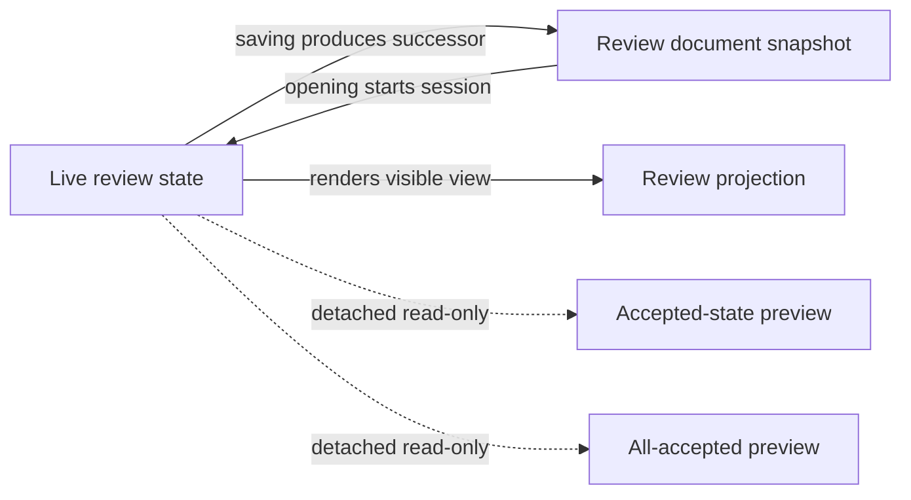
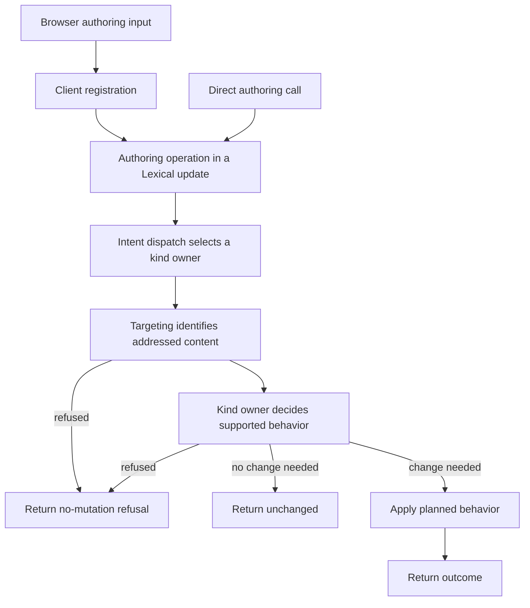
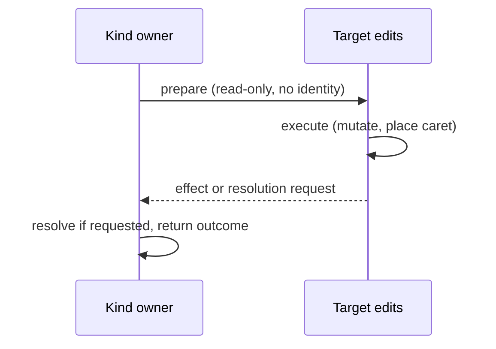

# How Lexical Review works

Lexical Review turns editing input into predictable review interactions. This
page explains how the package works and the principles guiding its direction,
for applications using it and contributors changing it. The ownership and
behavior guarantees below describe the current design so implementations can
be simplified without changing what callers observe. Modules describe
responsibilities, not a required file layout.

For installation and API usage, start with the
[package guide](packages/lexical-review/README.md). The
[proposal behavior contract](docs/proposal-behavior.md) defines the editing
outcomes this architecture must preserve.

## Principles

These principles are the package's north star:

Preserve the author's intent with the fewest proposals that retain meaningful
independent review decisions. Keep common proposal resolution to one action.
Refuse without mutation rather than silently lose meaning, including when
exchanging documents. Make the next keystroke's target unambiguous.

Prefer the simplest implementation that preserves these behaviors. Add
abstractions for demonstrated needs.

## How we use Lexical

Lexical provides the editor tree, selection, read/update transactions, and
browser command handling. The following sections connect the domain terms in
[CONTEXT.md](CONTEXT.md) to these implementation facilities.

### Review state and authoring session

The live Lexical `EditorState` represents review state during an authoring
session. It is the authoritative working representation of accepted content
and pending revision proposals. The session reads this state and exports
snapshots.

### Representing proposals in the tree

The [proposal behavior contract](docs/proposal-behavior.md#one-proposal-one-review-decision)
defines proposal identity and what resolves together. In the editor tree, each
proposal is represented by one or more review nodes carrying its required
proposal ID. Nodes representing parts of the same proposal carry the same ID.
For example, a replacement's deletion and insertion nodes share an ID so
inspection and resolution can address both sides as one proposal.

A proposal ID is distinct from a Lexical node key. The key addresses an
individual node in the editor tree; the proposal ID connects the nodes that
represent one reviewable change. Document validation and proposal inspection
check that those nodes form a supported proposal structure.

### Review projection and review document

Review nodes render markers in the editor's DOM as part of the review projection,
making pending revision proposals visible alongside accepted content.

Saving serializes the current editor tree into a review document, preserving
accepted content and current pending revision proposals with their IDs. The
review document is a snapshot of review state that can be reopened for authoring.

```mermaid
flowchart LR
    State[Live review state]
    Doc[Review document snapshot]
    Proj[Review projection]
    Acc[Accepted-state preview]
    All[All-accepted preview]
    State -->|saving produces successor| Doc
    Doc -->|opening starts session| State
    State -->|renders visible view| Proj
    State -.->|detached read-only| Acc
    State -.->|detached read-only| All
```

### Selection and interaction targets

Lexical selections identify the caret or selected range in the tree. Lexical
Review interprets that selection as an interaction target before determining
review intent. At proposal boundaries, accepted-side association and
proposal-side association distinguish which content the caret addresses for
operations such as typing. Collapsed deletion additionally uses direction to
address the neighbor at an edge. Selection classification alone is therefore
not the final deletion target; see
[collapsed Backspace and Delete](docs/proposal-behavior.md#collapsed-backspace-and-delete).

### Review interactions and editor updates

Inspection reads the editor state. Review interactions that author or resolve
revision proposals run inside a Lexical update. Client registration routes
browser commands to the same semantic operations available to direct callers.

## Responsibility ownership

| Stage       | Module                             | Owns                                                                                                                                                                                                                                               |
| ----------- | ---------------------------------- | -------------------------------------------------------------------------------------------------------------------------------------------------------------------------------------------------------------------------------------------------- |
| Entry       | Client registration                | Routes browser commands to semantic operations, coordinates composition, and reports outcomes. Decides whether to claim each command.                                                                                                              |
| Routing     | Intent dispatch                    | Chooses which kind owner sees the input, with explicit precedence when several handlers could apply. The first outcome wins, including a refusal.                                                                                                  |
| Routing     | Targeting                          | Identifies and validates the content addressed by the selection and deletion direction. Produces the interaction target. Never mutates.                                                                                                            |
| Decision    | Kind owners                        | Decide what an input means: create, correct, request resolution, leave unchanged, or refuse. Own review semantics. Delegate ordinary text mutation to target edits; own their specialized structural, fragment, and formatting mechanics directly. |
| Application | Target edits                       | Applies ordinary text insertion, paste, and deletion only: offset math, tree mutation, caret placement. Read-only prepare, then consuming execute. Never decides meaning and never resolves; returns resolution requests to the kind owner.        |
| State       | Authoring session                  | Opens a validated review document in an editor and provides access to live review state and saved snapshots.                                                                                                                                       |
| State       | Review document                    | Defines and validates the native serialized representation of accepted content and pending proposals.                                                                                                                                              |
| Decision    | Proposal inspection and resolution | Inspects a proposal by ID and accepts, rejects, or removes current proposals. Validates batch resolution before mutation and preserves unrelated pending work.                                                                                     |
| Exit        | Interchange adapter                | Assesses mappings between native review documents and WER interchange documents, reporting unsupported mappings without changing live review state.                                                                                                |

For ordinary text, kind owners decide and target edits carries out the change.
For example, typing inside a pending insertion is decided by its kind owner as
a correction under the same ID, then carried out by target edits. Deleting a
replacement's last new text is reported by target edits as needing resolution,
then carried out by the kind owner as a cancellation. Structural, fragment, and
formatting edits skip target edits entirely.

The interchange adapter operates on serialized documents. The separate
[`lexical-review-wer` package](packages/lexical-review-wer/README.md) currently
only reports unsupported atomic-fragment export; general import/export mapping
is not yet implemented.

### Package and host boundaries

The package exposes one framework-independent entrypoint, `lexical-review`,
for nodes, document and session APIs, review operations, `ReviewExtension`, and
direct input registration. It has no runtime React imports or `"use client"`
directive. Importing the package is safe without DOM globals; operations that
render DOM or consume browser events still need the corresponding environment.
React hosts establish their client boundary in their own editor components.

`ReviewExtension` bundles every review node with input registration and cleanup.
It opens a configured review document after Lexical's initial-state extension
runs, so initialization cannot overwrite the document. Its output provides the
current session, document opening and session closing, and runtime registration
options. Invalid document input preserves the active session; closing detaches
input routing without changing the current editor state.

`registerReviewSession` remains available for hosts that create and configure an
editor directly. React hosts use Lexical's `LexicalExtensionComposer` and retrieve
the same extension output as other frameworks. React dependencies belong to the
demo, whose browser tests exercise host integration. Use one registration owner
for each active session. See the [package guide](packages/lexical-review/README.md#core-loop)
for lifecycle and installation requirements.

Hosts own their application layout and review UI. The demo demonstrates
capabilities rather than defining a required host workflow.

## Interaction lifecycle

An input event is not itself a review intent. Its meaning depends on the current
interaction target: deleting accepted text may propose deletion, while deleting
inside a pending insertion may correct that insertion.

Client registration routes browser input to semantic operations. Direct callers
invoke those same operations inside a Lexical update. Intent dispatch chooses a
handler, targeting identifies the addressed content, and the kind owner decides
which behavior is supported there. The operation then applies that behavior and
returns an outcome.

```mermaid
flowchart TD
    Input[Browser authoring input] --> Route[Client registration]
    Route --> Operation[Authoring operation in a Lexical update]
    Direct[Direct authoring call] --> Operation
    Operation --> Dispatch[Intent dispatch selects a kind owner]
    Dispatch --> Target[Targeting identifies addressed content]
    Target --> Decide[Kind owner decides supported behavior]
    Target -->|refused| Refusal[Return no-mutation refusal]
    Decide -->|refused| Refusal
    Decide -->|no change needed| Unchanged[Return unchanged]
    Decide -->|change needed| Apply[Apply planned behavior]
    Apply --> Result[Return outcome]
```

This flow describes responsibilities rather than a fixed sequence of helper
calls. A handler can inspect the target before deciding whether it applies.
Returning `null` lets dispatch try another handler; returning an outcome ends
dispatch. A refusal never permits a fallback edit. Execution can also refuse
during its checks, but every refusal must occur before mutation.

Explicit accept, reject, and remove actions address proposals by ID, without
selection targeting or authoring dispatch. Whether invoked through a browser
command or a direct call, proposal resolution validates the requested proposals
before applying the action to their current content. Authoring can also trigger
resolution: deleting a replacement's last new text cancels the replacement and
restores its old text.

### Operation outcomes

The kind owner turns helper results into one caller-visible outcome. Exact
helper shapes live in the [result types](packages/lexical-review/src/ReviewIntent.ts);
a ready helper result is not itself the final outcome.

| Operation outcome | Meaning                                                                                                       |
| ----------------- | ------------------------------------------------------------------------------------------------------------- |
| `changed`         | The operation changed state, including local input formatting; it need not create a proposal.                 |
| `unchanged`       | The supported operation needed no change.                                                                     |
| `refused`         | An unsupported or unsafe interaction was declined without mutation, with a machine-readable code and message. |
| `failed`          | A route reported an unexpected failure; the no-mutation refusal guarantee does not apply.                     |

Command claiming is separate from success. Client registration reports outcomes
through `onOutcome`, so a handled command may still have been refused. Direct
mutation operations run inside `editor.update()`; the returned outcome describes
the attempted operation, not a notification that the surrounding update has
committed.

Refusal always precedes mutation; failure is the unexpected path. Unexpected
mutation errors escape the update callback into Lexical's error handling and
rollback. Composition restores its captured state when it can and reports
`failed` when normalization throws. A reported failure carries no preservation
guarantee.

### Preparing browser input

Some browser input needs coordination before it reaches a semantic operation.
Composition captures state before provisional native input, restores that
snapshot at completion, and routes the completed text through semantic
operations. Clipboard intake normalizes external content before authoring;
ordinary clipboard metadata confers no proposal identity. These responsibilities
belong to the input routes rather than to each kind of edit.

### Directional deletion targeting

Deletion tries handlers in this order. The first handler returning an outcome
ends dispatch, including when that outcome is a refusal:

1. **Fragment handling** checks whether deletion corrects a fragment, including
   when the caret is adjacent to fragment content in the same paragraph. If
   deletion at a fragment's edge targets content outside it, this handler lets
   dispatch continue.
2. **Paragraph-boundary handling** checks character Backspace/Delete for a
   supported structural interaction. Word deletion skips this step because it
   does not author or cancel paragraph-boundary proposals. See the
   [package guide](packages/lexical-review/README.md#authoring-operations)
   for choosing deletion granularity.
3. **Text handling** identifies the content addressed by the selection or
   deletion direction and applies its editing rules.

For text handling, the caret's location alone does not always identify what
changes. At an edge, deletion direction can select neighboring content belonging
to another proposal or to accepted document state. The addressed content
determines whether deletion creates, continues, shortens, or removes pending
work.

The [behavior contract](docs/proposal-behavior.md#collapsed-backspace-and-delete)
defines the resulting proposal and caret behavior.

### Target edits

Kind owners decide what an edit means; target edits carries out ordinary text
insertion, paste, and deletion. It calculates text offsets, changes the tree,
and places the caret. Structural, fragment, and formatting edits keep their own
mechanics.

```mermaid
sequenceDiagram
    participant Owner as Kind owner
    participant Applier as Target edits
    Owner->>Applier: prepare (read-only, no identity)
    Applier->>Applier: execute (mutate, place caret)
    Applier-->>Owner: effect or resolution request
    Owner->>Owner: resolve if requested, return outcome
```

Each shared edit runs in two phases. Preparation reads live state without
changing it and without allocating proposal identity. What it resolves depends
on the operation:

- Insertion and paste supply a declarative plan.
- Deletion resolves the addressed target, plus the affected span or resolution
  request and any deletion proposal to continue.

Execution then consumes that prepared work directly. For deletion, this means
neighbors are not looked up a second time. Only deletion can request proposal
resolution through this path; the kind owner carries it out.

Because preparation reads live state, prepared work goes stale after any
mutation. Deletion therefore prepares and executes consecutively inside one
editor update, with no intervening mutation, and targets or prepared deletions
are never stored across updates. Cut shows the rule in action: it preflights
read-only for the clipboard write, discards that work, then prepares again for
the deletion.

Co-located tests cover preparation, refusal preservation, and caret placement.

## Guarantees that survive refactoring

- A no-mutation refusal preserves accepted content, pending proposals, the
  review projection, and logical selection. Returned refusals must precede
  mutation; unexpected errors are a separate path.
- Saving produces a successor review document without changing the session's
  input document or ending the session. See the [authoring ADR](docs/adr/0002-freeze-serialized-inputs-during-authoring.md).
- Resolution acts on current proposal content, preserves unrelated pending
  work, and leaves no terminal resolution history. Batch resolution validates
  before mutation.
- Accepted-state and all-accepted previews operate on detached content, leaving
  the input and live editor unchanged. An indeterminate all-accepted preview
  throws.

Proposal editing and resolution rules live in the [behavior contract](docs/proposal-behavior.md).
API usage examples live in the [package guide](packages/lexical-review/README.md)
and co-located tests. Co-located tests cover the shared mechanics; demo browser
fixtures exercise actual input and selection. Extend those contracts when behavior
changes instead of creating a second exhaustive behavior specification here.

## Keeping changes small

Before changing library code, work through this checklist:

1. Name the behavior affected, its owner in the table above, and the test that verifies it.
2. Route new input through the existing dispatch entries; add a dispatch entry only when no kind owner fits.
3. Refuse before mutation; never store targets or prepared deletions across updates.
4. Add an abstraction only when it removes repeated domain knowledge or supports a demonstrated variation; explain what callers no longer need to know. Prefer explicit dispatch while the set of owners is small and known.

Do not add a parallel identity scheme beside proposal IDs, a verbatim clipboard marker mode, resolution history in review documents, or cross-update prepared state. Internal helpers and file layout may be rewritten when the observable contracts remain intact. A change to a guarantee requires an explicit contract decision; a consequential lasting tradeoff belongs in an ADR.

Maintain this page when ownership, state authority, or lifecycle guarantees
change. Keep vocabulary in [CONTEXT.md](CONTEXT.md), exact fields in types, and
proposal behavior in its contract and tests. Update links when
moving their targets; ordinary helper refactors need no architecture narrative.
